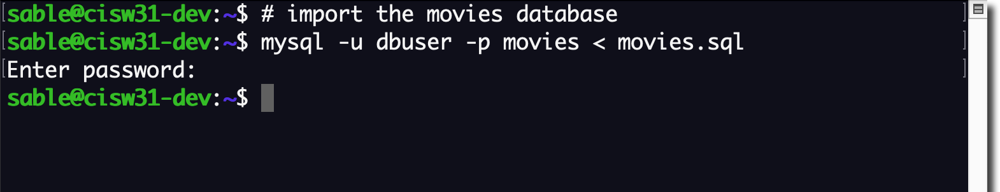

# CISW31 Movies

These files go along with an assignment to display data from a movie database.

<pre>
movies
├── includes
│   ├── db-connect.php
│   ├── footer.php
│   ├── header.php
│   └── style.css
├── index.php
├── movies-highest.php
├── movies-score.php
└── movies-year.php
</pre>

## Screenshots

